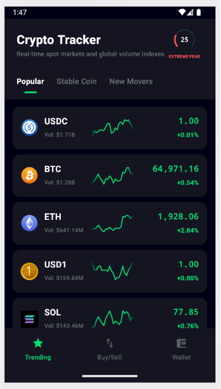
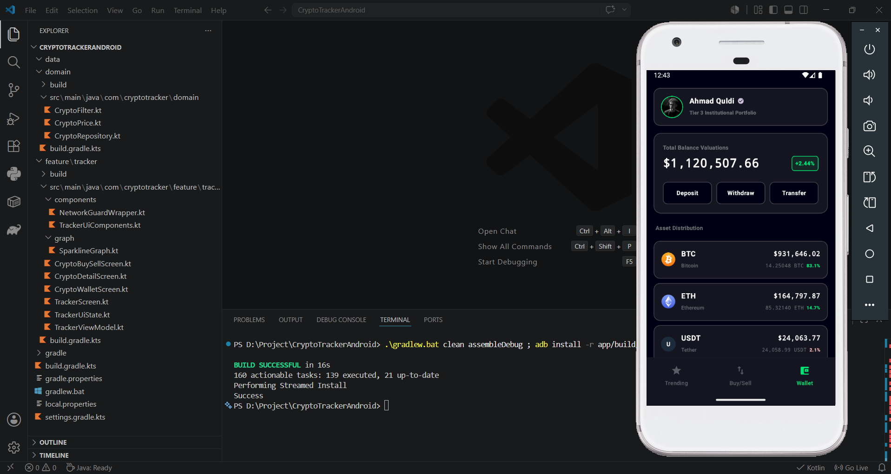
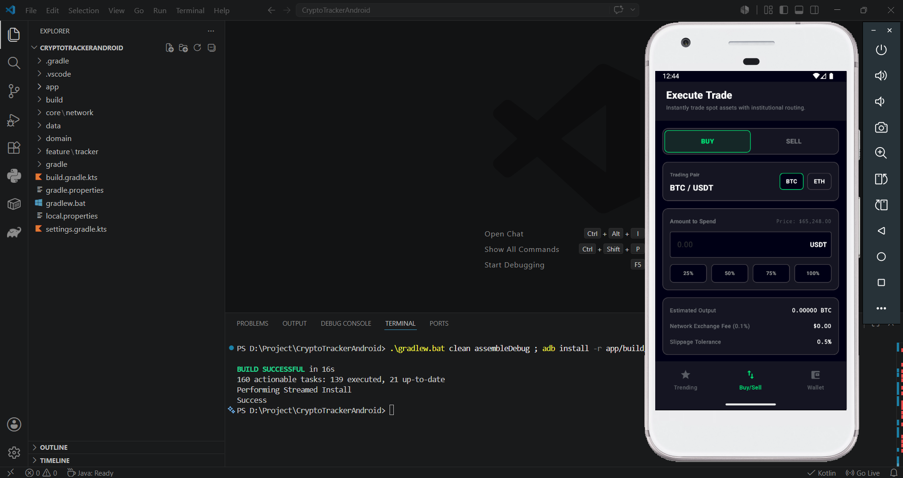

# CryptoTracker (High-Fidelity FinTech MVP)

A production-ready, highly-optimized Android application built **100% from scratch using VS Code**. This repository demonstrates a decoupled development workflow bypassing heavy IDE structures, implementing **Clean Architecture**, **Unidirectional Data Flow (UDF)**, and strict **Material 3 Design Tokenization** via a lightweight native compilation pipeline.

---

## App Preview

<p align="center">
  
  
  
</p>

---

## Debug APK Download

You can download the pre-compiled debug APK directly to test the application on a physical device or emulator:

* [Download Latest Debug APK](https://github.com/quldi/CryptoTracker/releases/latest)

Alternatively, if you are building the project locally from the source code, the compiled binary will be generated at the following path after running the build command:
`app/build/outputs/apk/debug/app-debug.apk`

## VS Code IDE Ecosystem & System Tools

This project was built independently without any dependencies on Android Studio, leveraging a lightweight **Visual Studio Code** extension stack to minimize memory overhead and optimize UI rendering performance up to 60 FPS:

### Development Environment
* **IDE:** Visual Studio Code (VS Code) v1.x
* **Core Extensions Stack:**
  * `FWCD.kotlin` (Kotlin Language Support & Code Completion)
  * `vscjava.vscode-gradle` (Gradle Tasks Management & Dependency Pipeline)
  * `ms-vscode.cpptools` (Skia NDK Underlying Interop Engine Compiler)
* **SDK Tools:** Android SDK Build-Tools, Command-line tools (sdkmanager), Platform-tools (adb).

### Language & Framework
* **Language:** Kotlin v2.x (Strict Type-Safety & Asynchronous Primitive Coroutines)
* **UI Framework:** Jetpack Compose (Declarative UI Components with Standard Slot-API)
* **Design System:** Material 3 (M3 Custom Dynamic Token Architecture)
* **Concurrency Engine:** Kotlin Coroutines & Asynchronous State Streams (StateFlow / SharedFlow)
* **Build System:** Gradle Kotlin DSL (.gradle.kts) with a multi-module architecture

---

## Core Feature Architecture

* **TrackerScreen (Unified Navigation Hub):** Manages high-level global routing and hosts the core market view states (Trending, Buy/Sell, Wallet) using a declarative layout. Navigation is fully decoupled from legacy Fragment lifecycles.
* **CryptoDetailScreen & SparklineGraph (Interactive Canvas):** Visualizes historical chart data using hardware-accelerated vectors inside a custom canvas (`SparklineGraph.kt`), implementing dynamic color mapping based on baseline price trends.
* **CryptoWalletScreen (Asset Valuation Matrix):** Simulates an institutional portfolio balance. Displays asset allocation percentages, verified profile badges, and automated capital transfer action docks.
* **CryptoBuySellScreen (Flat-Order Execution Engine):** A flat-order spot transaction emulator entirely free from structural layout overlapping. Features rapid allocation toggles (25% to 100%) and automated network fee calculations (0.1%).
* **TrackerViewModel & TrackerUiState (UDF Engine):** Centralizes the management of reactive state flows, pushing predictable UI states downstream and handling incoming user actions asynchronously.

---

## Architectural & Directory Layout

The codebase enforces strict modular separation boundaries across independent Gradle submodules:

```text
.
├── app/             # Root Application, Dependency Injection initialization, System Theme Configurations
├── core/network/    # Low-level network configurations and anti-censorship WebSocket client engines
├── data/            # Repository implementations and mock data processing engines
├── domain/          # Enterprise business rules, domain entities, and abstract repository contracts
└── feature/tracker/ # Feature module containing all Jetpack Compose UI assets and ViewModels
```

Detailed package and file distribution mapping mapped directly from the source tree:

```text
CryptoTrackerAndroid
├── app/
│   └── src/main/java/com/cryptotracker/app/
├── core/network/
│   └── src/main/java/com/cryptotracker/core/network/
│       └── CryptoWebSocketClient.kt
├── data/
│   └── src/main/java/com/cryptotracker/data/
│       └── CryptoRepositoryImpl.kt
├── domain/
│   └── src/main/java/com/cryptotracker/domain/
│       ├── CryptoFilter.kt
│       ├── CryptoPrice.kt
│       └── CryptoRepository.kt
└── feature/tracker/
    └── src/main/java/com/cryptotracker/feature/tracker/
        ├── components/
        │   ├── NetworkGuardWrapper.kt
        │   └── TrackerUiComponents.kt
        ├── graph/
        │   └── SparklineGraph.kt
        ├── CryptoBuySellScreen.kt
        ├── CryptoDetailScreen.kt
        ├── CryptoWalletScreen.kt
        ├── TrackerScreen.kt
        ├── TrackerUiState.kt
        └── TrackerViewModel.kt
```

---

## Enterprise Design System (M3 Tokenization)

Hardcoded local hex color values are completely eliminated. All UI elements strictly inherit their color values from centralized global **Material 3 Design Tokens**:

| Material 3 Design Token | Hex Code Target | Visual Target Mapping |
| :--- | :--- | :--- |
| `MaterialTheme.colorScheme.background` | `#080B11` | Application Canvas Base Color |
| `MaterialTheme.colorScheme.surface` | `#121722` | Component Cards, Header Bars, Elevated Dockers |
| `MaterialTheme.colorScheme.primary` | `#00E676` | Positive Trends, Active Toggles, BUY Actions |
| `MaterialTheme.colorScheme.error` | `#FF5252` | Negative Drops, Active Toggles, SELL Actions |
| `MaterialTheme.colorScheme.outlineVariant` | `#1E293B` | Micro Dividers & Component Borders |

> **Seamless Navigation Integration:** The bottom navigation strip (`TrackerBottomNavBar`) is locked with `containerColor = Color.Transparent` inside a `navigationBarsPadding` wrapper. This completely disables the default Android Material 3 Elevation Primary Tint that distorts visual accuracy, ensuring a clean edge-to-edge finish that blends seamlessly with the OS navigation gestures.

---

## Build Pipelines & Quick Deployment

Execute the following unified automation chain command inside the integrated VS Code terminal to clear cache artifacts, compile a clean debug APK, and deploy it directly onto your connected Android device or emulator:

### Windows (PowerShell)
```powershell
.\gradlew.bat clean assembleDebug ; adb install -r app/build/outputs/apk/debug/app-debug.apk
```

### macOS / Linux (Terminal)
```bash
./gradlew clean assembleDebug && adb install -r app/build/outputs/apk/debug/app-debug.apk
```

---

## Production Roadmap

- [ ] Migrate current simulated random data pipelines into live low-latency streaming feeds via Binance WebSockets API integration.
- [ ] Implement secure offline persistence caching protocols leveraging a reactive Room Database framework layer.
- [ ] Transition global route configurations into explicit type-safe cross-module paths via native Compose Navigation v2.x.